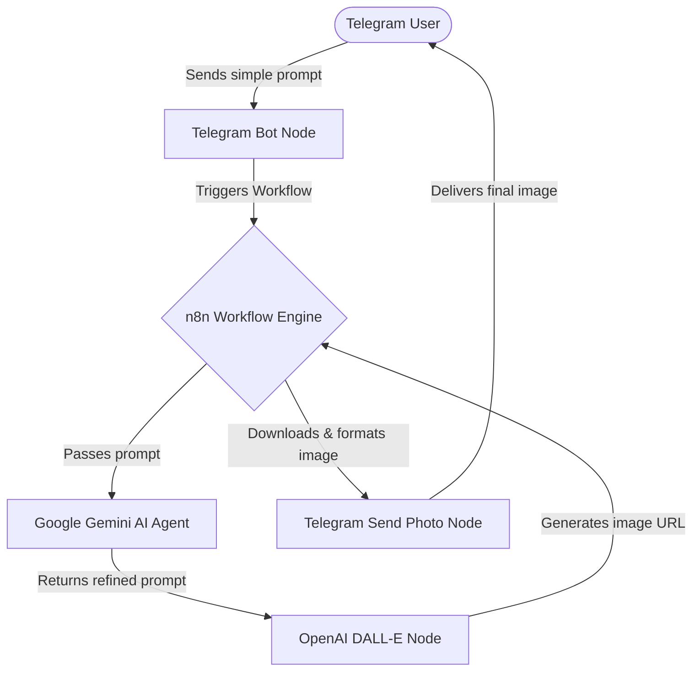

# 🚀 AI Image Generation Bot (n8n + Gemini + OpenAI)

A fully automated Telegram bot that takes simple user prompts, refines them using an advanced Google Gemini AI Agent, generates high-quality images via OpenAI's DALL-E API, and delivers the results instantly back to the user—all orchestrated with **n8n** automation.

---

## 💡 Overview

Instead of manually crafting detailed prompts or logging into multiple web interfaces to generate images, this project builds a completely automated pipeline. Users interact with a single Telegram chat, and the background system handles context expansion, API orchestration, and image delivery.

### Key Features
- **Telegram Interface**: Seamless input and output interface for users.
- **n8n Orchestration**: Low-code workflow automation engine that connects APIs without writing bulky backend code.
- **Gemini AI Agent**: Refines simple inputs (e.g., *"cat in space"*) into rich, descriptive prompts optimized for image generation.
- **OpenAI DALL-E Integration**: High-fidelity image synthesis using OpenAI's image generation endpoint.
- **End-to-End Stability**: Built-in error handling and rate-limit mitigation via n8n workflows.

---

## 🔁 Workflow Architecture

The entire pipeline follows a reactive flow:



---

## 🛠️ Tech Stack & Integrations

- **Orchestration**: [n8n](https://n8n.io/) (Self-hosted or Cloud)
- **AI Text Processing**: Google Gemini API
- **AI Image Generation**: OpenAI API (DALL-E 3)
- **User Interface**: Telegram Bot API

---

## 🚀 Setup & Installation

### 1. Prerequisites
- An active [n8n](https://n8n.io/) instance.
- A Telegram Bot token (obtained via [@BotFather](https://t.me/BotFather)).
- An [OpenAI API Key](https://platform.openai.com/).
- A [Google Gemini API Key](https://aistudio.google.com/).

### 2. Project Files
Rename [.env.example](.env.example) to `.env` and fill in your keys:
```bash
cp .env.example .env
```

### 3. Setup the n8n Workflow
1. Create a new workflow in your n8n dashboard.
2. Import the `workflow.json` (if available in this repo) or manually connect the following nodes:
   - **Telegram Trigger Node**: Listen for new messages.
   - **Gemini Node**: Uses the system instructions found in [prompts/gemini-agent-prompt.txt](prompts/gemini-agent-prompt.txt).
   - **HTTP Request / OpenAI Node**: Send the refined prompt to `https://api.openai.com/v1/images/generations`.
   - **Telegram Send Photo Node**: Send the generated binary/URL back to the sender's Chat ID.

---

## 🧠 Prompt Engineering (Gemini Agent)
The Gemini Agent uses specific instructions to act as a Prompt Engineer. It translates simple user input into detailed scenes with custom lighting, camera style, composition, and mood before sending it to OpenAI DALL-E.

The exact prompt instructions can be viewed in the [prompts/gemini-agent-prompt.txt](prompts/gemini-agent-prompt.txt) file.

---

## ⚠️ Challenges & Learnings
- **API Rate Limits**: Handled by setting appropriate timeout intervals and retry logic inside the n8n HTTP nodes.
- **Prompts Structuring**: Optimized by routing inputs through the Gemini Agent, which drastically improved the visual composition and artistic quality of the final images.
- **Workflow Stability**: Leveraged n8n's visual error-trigger paths to notify the user if the model fails or policy violations occur.
